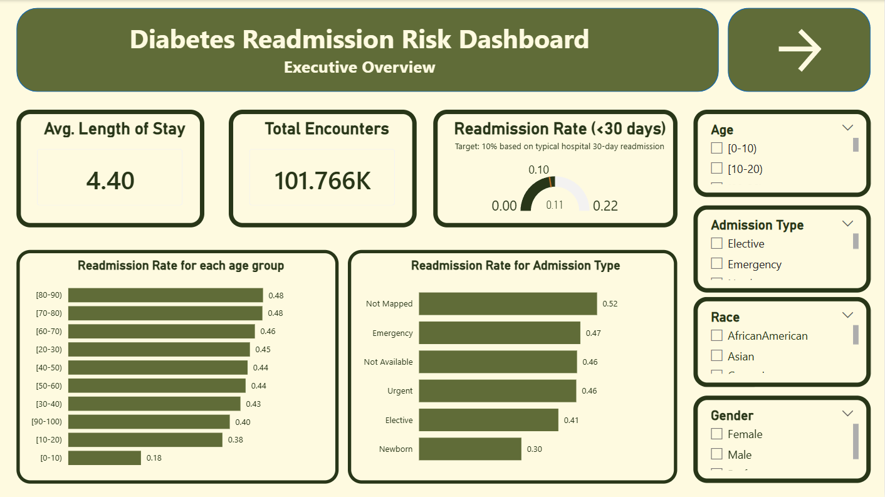
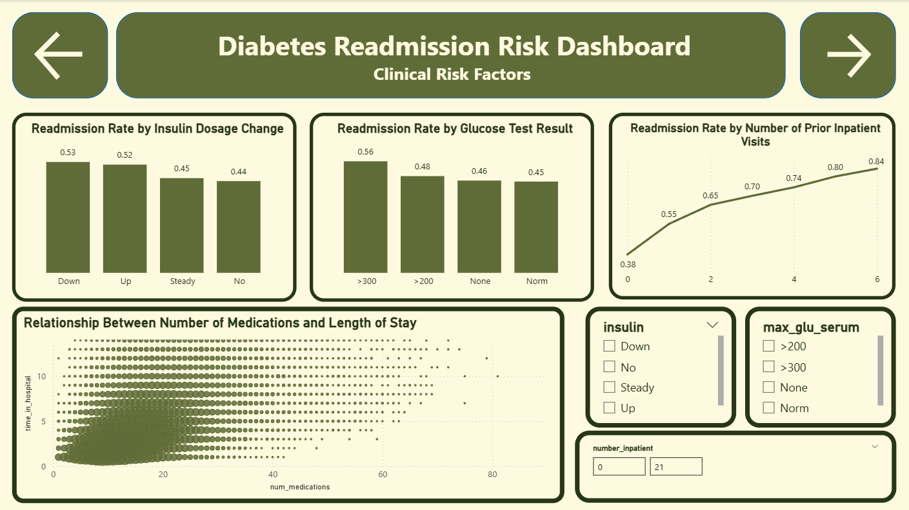
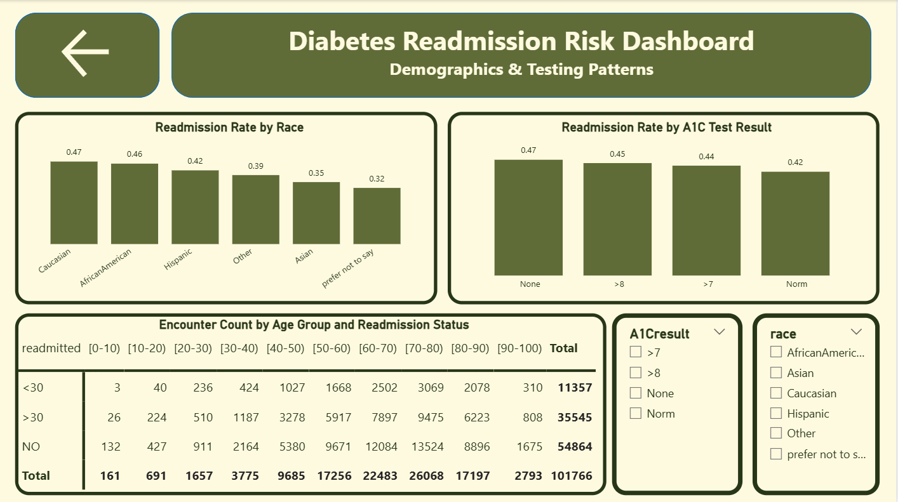

# Diabetes Hospital Readmission Analysis

A full end-to-end data analysis project examining which patient and encounter-level factors are most strongly associated with 30-day hospital readmission among diabetic inpatients, using real clinical data from 130 U.S. hospitals (1999–2008).

Built as an individual data analysis project covering the complete workflow: dataset selection, data cleaning (Excel / Power Query), exploratory data analysis, KPI-driven Power BI dashboard, and a written business report.

## 📊 Project Overview

**Business domain:** Healthcare — hospital operations and clinical quality analytics

**Objective:** Identify which factors (prior hospital utilization, glucose/A1C testing, insulin dosage changes, age, admission type, etc.) most strongly predict early readmission, and translate those patterns into a KPI dashboard that hospital administrators could use to flag high-risk patients and track performance against a readmission benchmark.

**Dataset:** [Diabetes 130-US Hospitals for Years 1999–2008](https://archive.ics.uci.edu/dataset/296/diabetes+130-us+hospitals+for+years+1999-2008), originally published by Strack et al. (2014) in *BioMed Research International*, sourced from the Health Facts clinical database (Cerner Corporation). Real, de-identified inpatient encounter data — not synthetic.

- **101,766** encounters
- **50** original attributes → narrowed to **22 core variables** + **3 engineered label columns** = **25 columns** in the final cleaned dataset

## 🗂️ Repository Contents

| File | Description |
|---|---|
| `Dataset_Description.pdf` | Dataset title, source, domain, variable descriptions, and justification for selection |
| `cleaned_dataset.xlsx` | Final cleaned dataset (101,766 rows × 25 columns) |
| `HEALTHCARE_DASHBOARD.pbix` | Interactive Power BI dashboard (3 pages, KPI gauge, slicers, DAX measures) |
| `Project_Report.pdf` | Full written report — data cleaning log, EDA findings, dashboard summary, KPI explanation, business insights & recommendations |

## 🧹 Data Cleaning Highlights

- Recoded inconsistent placeholder values (`"?"` in `race`) to an explicit category rather than leaving them ambiguous
- Retained `gender = "Unknown/Invalid"` rows (recoded, not dropped) to avoid discarding real data
- Built lookup/mapping tables to translate coded ID fields (`admission_type_id`, `discharge_disposition_id`, `admission_source_id`) into human-readable labels, keeping the original IDs for traceability
- Deliberately preserved `max_glu_serum` / `A1Cresult` "not tested" categories rather than dropping high-missingness columns, since "not tested" is itself a meaningful clinical signal
- Confirmed no duplicate encounters, no negative values, and documented (rather than removed) expired/deceased discharge dispositions

## 🔍 Key Findings

- **Prior inpatient visits are the strongest predictor of readmission** — 30-day readmission rate rises from **8.29%** (0 prior visits) to **34.95%** (6 prior visits), roughly a 4x increase
- **Elevated glucose readings (>300)** show a **16.55%** 30-day readmission rate vs. **10.9–12.7%** for other test categories
- **Insulin dosage changes** (Up: 12.62%, Down: 13.72%) are associated with higher readmission than steady/no-change patients (~10%)
- **Age** shows a steady upward trend in readmission rate from childhood through the 80s
- **A1C testing** shows a weak/inconsistent relationship with readmission — a genuine null finding, reported honestly rather than omitted
- **Number of medications and length of stay** are moderately correlated (**r = 0.47**)

## 📈 Dashboard

Three-page Power BI dashboard:
1. **Executive Overview** — KPI gauge (30-day readmission rate vs. 10% target), summary cards, readmission by age/admission type
2. **Clinical Risk Factors** — readmission by prior inpatient visits, glucose result, insulin change; bubble scatter of medications vs. length of stay
3. **Demographics & Testing Patterns** — readmission by race and A1C result, age × readmission pivot table

### 📸 Dashboard Screenshots

**Page 1 — Executive Overview**

**Page 2 — Clinical Risk Factors**

**Page 3 — Demographics & Testing Patterns**

**KPI:** 30-Day Readmission Rate, target **10%** (based on general CMS HRRP-style benchmarks). Overall rate: **10.99%** — near target in aggregate, but concentrated risk in specific subgroups (high prior utilization, high glucose) running 2–3x above target.

## 🛠️ Tools Used

- Microsoft Excel (Power Query for cleaning, Power Pivot/DAX for measures)
- Power BI Desktop (dashboard, KPI, DAX measures)
- Manual EDA via PivotTables and summary statistics

## ⚠️ Limitations

This is an observational, descriptive analysis. Relationships identified (e.g., insulin dose changes, A1C testing) indicate association, not causation. Readmission percentages beyond ~7 prior inpatient visits are based on very small sample sizes and are excluded from headline visuals as unreliable.

## 👤 Author

Malak Usama Mohamed — Data Analysis Midterm Project
